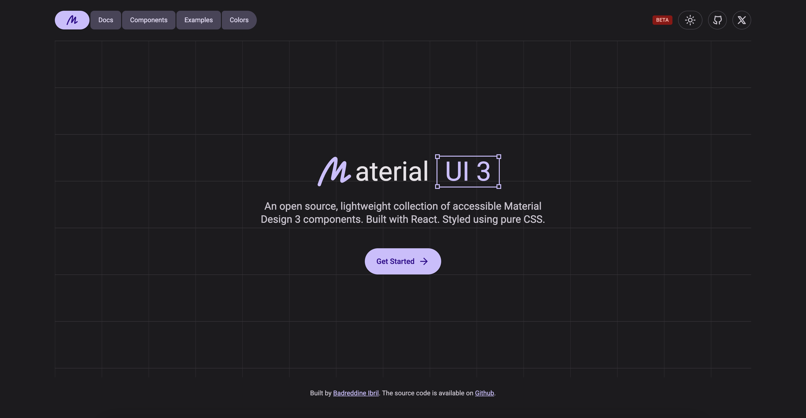

  

  <h1>MUI 3</h1>

  

    An open source, lightweight collection of accessible Material Design 3 components. Built with React. Styled using pure CSS.
     
     
    <a href="https://mui3.com" target="_blank"><strong>Get Started »</strong></a>
  

 

## Documentation

Docs available at http://mui3.com/docs.

## Beta

[MUI3](http://mui3.com/) is still in beta, so expect a few bugs here and there. If you spot anything, or have ideas for improvements, feel free to open an issue.

## License

Licensed under the [MIT license](https://github.com/BadreddineIbril/mui3/blob/main/LICENCE.md).
